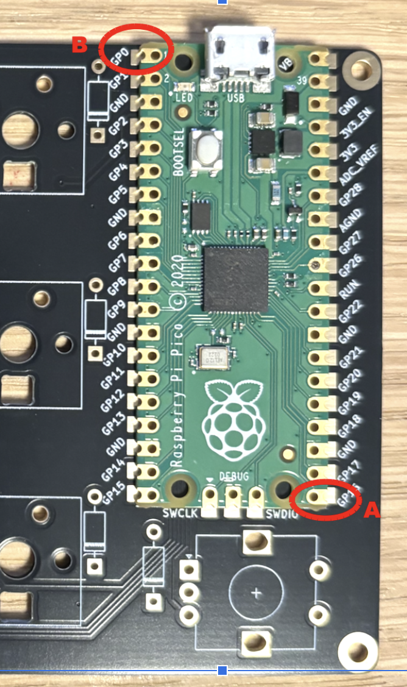
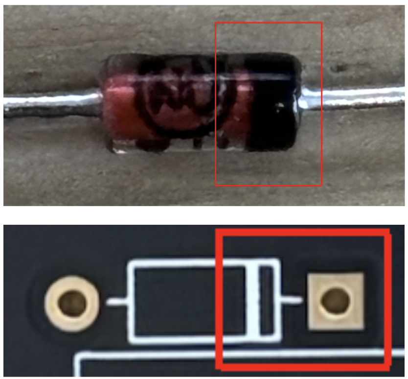
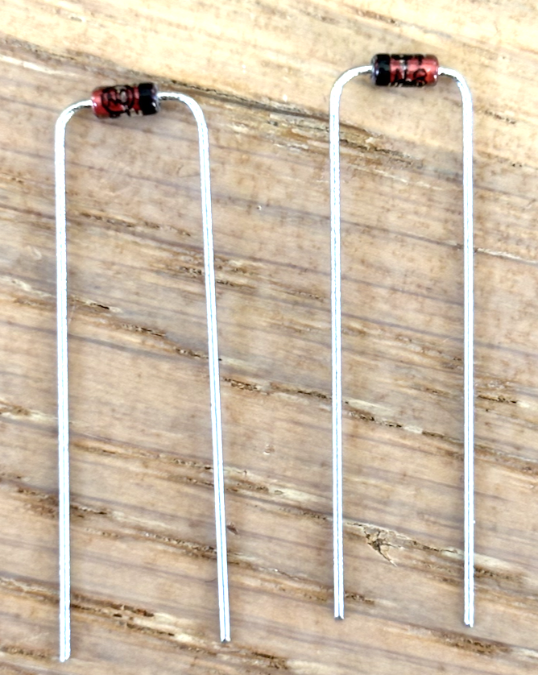
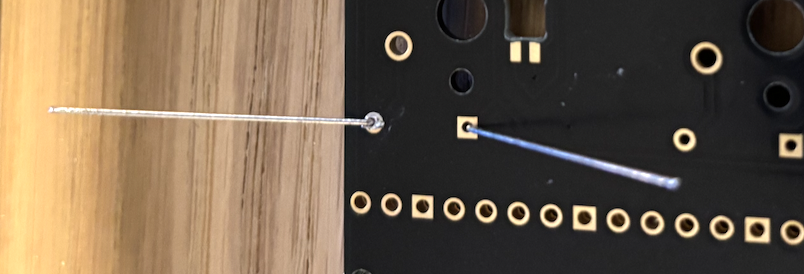
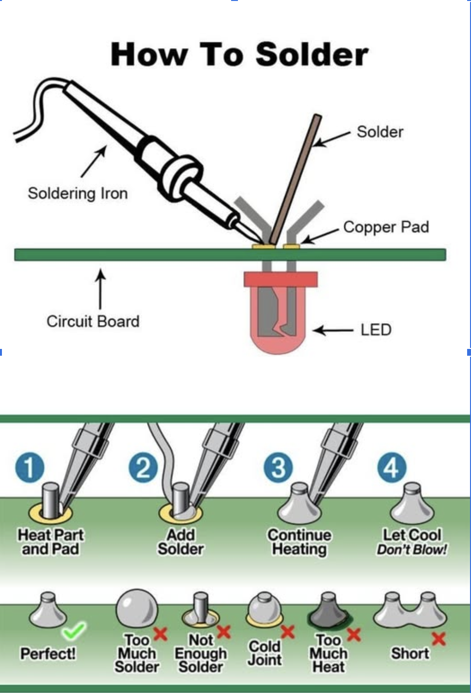
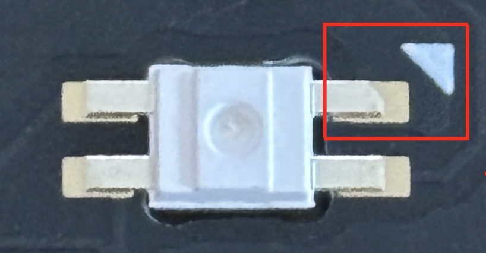

# Assemble your Env-MCRO Keyboard

This assembly guide and all the files neccessary are found at the GitHub repository:
https://github.com/vidarw/booster-2025-macroboard
 

## Assembly Checklist

1. [ ] Flash firmware to Raspberry Pi Pico *(no soldering)*
2. [ ] Solder Raspberry Pi Pico to PCB
3. [ ] Bend and attach diodes to PCB *(no soldering)*
4. [ ] Solder diodes to PCB
5. [ ] Attach and align front plate and switches *(no soldering)*
6. [ ] Solder buttons to PCB
7. [ ] *BONUS* Solder RGB LEDs to PCB

**Important!** While waiting for the soldering station read through the steps. There are certain steps that can be prepared while waiting for your turn.

## Step 1 - Flash Firmware

Dowload the **enviousdesign_mcro_rev2_via.uf2** and **EnvKB MCRO 2.0.json** files from the *firmware* folder. The **uf2** file is the firmware file, while the **JSON** file will be used later for to program the keyboard.

Connect the Raspberry Pi Pico to your computer. It will appear as a drive named **RPI-RP2** (if it does not appear, reconnect the Pi Pico while holding the white *BOOTSEL* button).

If flashed successfully it will reboot automatically and not appear as a drive.
If you want you can now take a look at the user instructions on GitHub to setup you browser to configure the keyboard.
 

## Step 2 - Solder the Pi Pico to the PCB

Start by applying a layer flux to the metal pads on the black PCB as this makes it easer for solder to flow. This is especially useful for surface mount components, but usually not needed for throug holde components.

Start by soldering the pins A. Check alignment before the pin marked B on diagonal is soldered. Once again ensure correct alignment. The moment multiple pins are soldered it is very difficult to correct alignment in any way so double check alignment withing each pin.

When the Pico is seated correctly solder the rest of the pins. The 3 debug pins in the rear is optional.

**WHEN DONE: PASS THE IRON TO THE NEXT GROUP MEMBER**
 

## Step 3 -  Bend and attach diodes to the PCB

**Important!** You can prepare the diodes at any time by pre-bending them, but you should not put them into the PCB before step 2 is fully completed and your Pi Pico is attached to the board.

Bend the diodes legs 90 degrees as illustrated and put them into the holes marked for diodes. Remember the diode polarity and make sure that the black side on the diode aligns with the band on the black PCB.

When the diodes are fully inserted, bed the legs outwards to keep it in place. After all diodes are in place check, double thecl that they are tight to the PCB, not sagging and polarization 

 
 

## Step 4 - Solder diodes to PCB

Use the illustration to the right as a guideline:
Put the iron next to the leg touching the leg and the pad, then add solder wire towards the pad.
The soldering wire already contains enough flux for this task.

**WHEN DONE: PASS THE IRON TO THE NEXT GROUP MEMBER**

Cut all the dode legs with the wire cutter.

**Important!** When cutting a leg, hold it still with one hand while cutting with the other. Otherwise pins WILL be flying. We have spare components, but no spare eyes!

 

## Step 5 - Attach front plate and mount keyboard switches

Attach and align the front plate and insert the mechanical keyboard switches.
Make sure th
w

Solder the keyboard switches the same way as the diodes,
a bit more solder is required to accommodate for the larger holes.
No need for flux in this step either as the solder contains enough for this task as well

## Step 6 - Solder buttons to PCB

Solder the mechanical switches the same way you would solder. However you will need to feed a lot more solder than with the diodes. No flux needed as the solder itself contains enough for a successful solder.

**WHEN DONE: PASS THE IRON TO THE NEXT GROUP MEMBER**

## Step 7 - #BONUS# Solder RGB LEDs to PCB

Put the board keys down with the Pi Pico to the left. Start in the upper right corner and solder from right to left one row at the time. Solder and test each LED in turn as they are soldered by connecting the board to a computer. Pay attention to orientation and polarity.

Pass the iron when not needed or every few LEDs so we get even progress.

 
This is the easiest way to solder the RGB LEDs:

1) Apply a bit of flux to all 4 pads of the LED
2) Place and orient the LED with tweezers.
3) Solder one side carefully solder other side.

Turn the board to get an angle that suites you.
