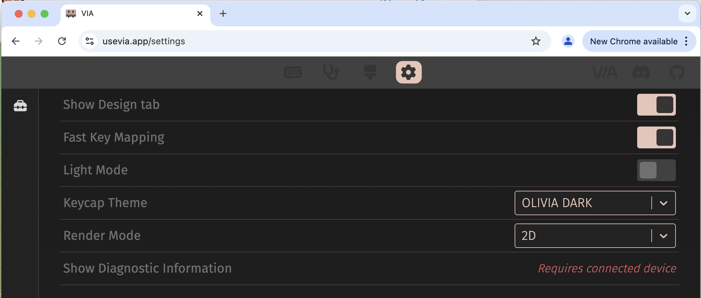
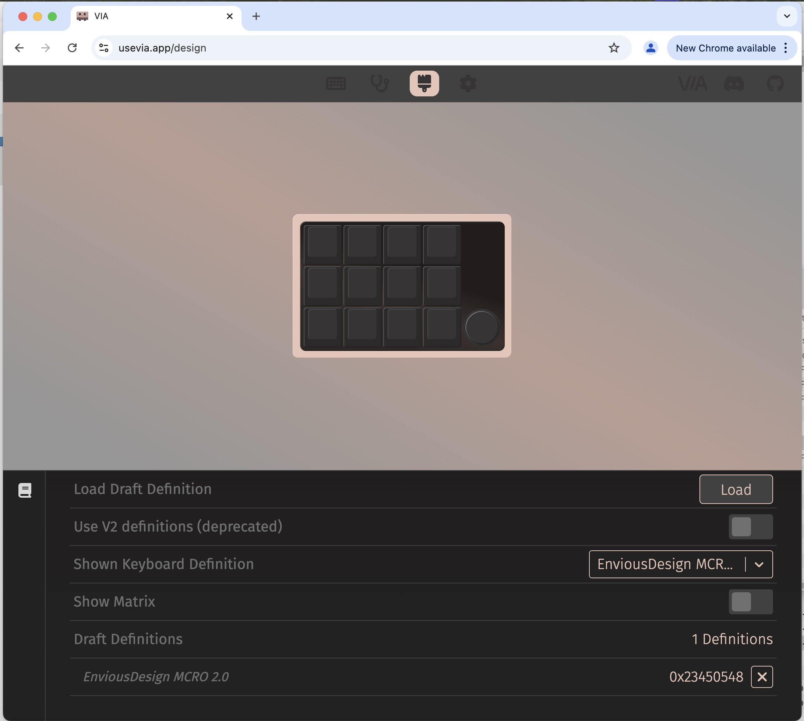
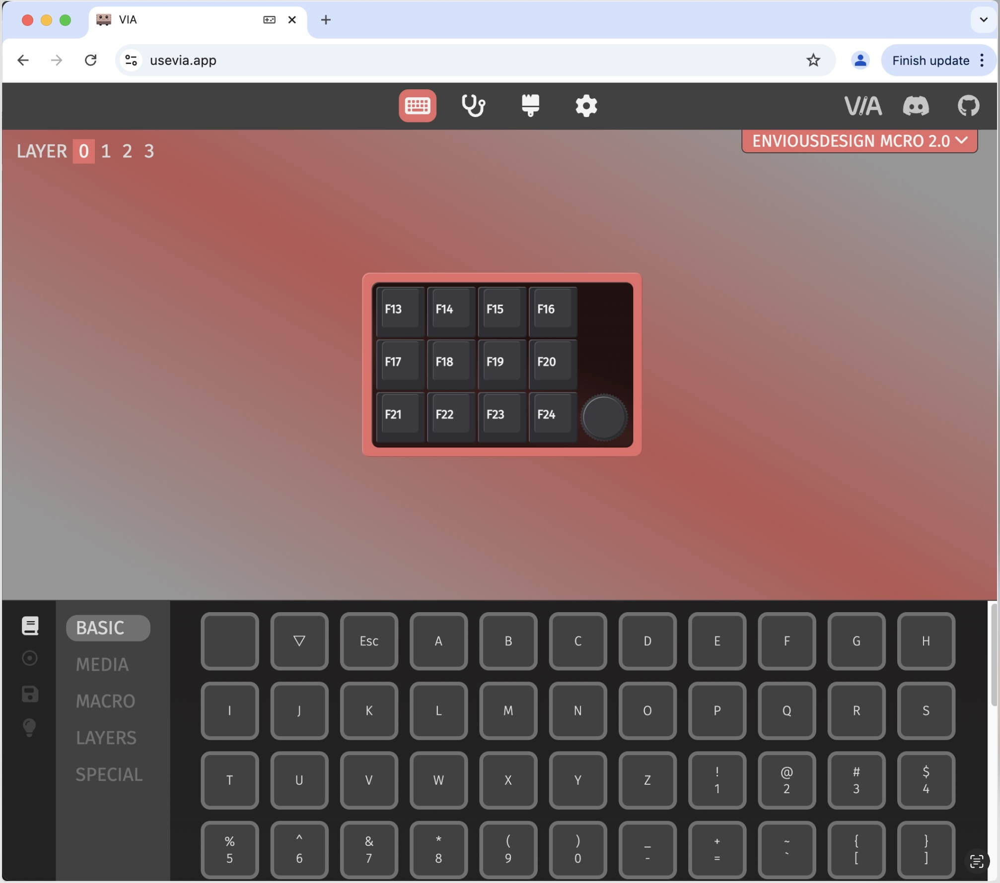

# Env-MCRO User Instructions
For the latest instructions please check for the latest revision at GitHub:

QR Code Here

## Getting Started
Env-MCRO is a macro keyboad with 12 keys that can be individually mapped. It uses QMK/VIA firmware and can be easily remapped using the VIA user interface [https://usevia.app/](https://usevia.app/). See instructions below.

 The default key map is **F13-F24** which are virtual keys that can be mapped directly into software and games or used with macro software, such as [AutoHotkey](https://www.autohotkey.com/) or *[PyAutoGUI](https://pyautogui.readthedocs.io/)*.

**Important!** MacOS does not properly register *F20-F24*  and *F14-15* is used to control screen brightness. For full compatibility with MacOS you need to remap the keys using VIA.

### Reconfigure Keys using VIA

To reconfigure the keys on your Env-MCRO, you will need to use the VIA configurator. Follow these steps:

1. Download the [Env-MCRO JSON configuration](https://github.com/retro-city/env-mcro-booster-edition/blob/main/firmware/EnvKB%20MCRO%202.0.json) file from the firmware folder :  https://github.com/retro-city/env-mcro-booster-edition/blob/main/firmware/EnvKB%20MCRO%202.0.json  

2. Open a Chrome, Edge or any other Chromium-flavored browser and navigate to [https://usevia.app/](https://usevia.app/).

3. Click settings (cogwheel) and enable the design tab:    

4. In the VIA configurator, click on the "Design" tab and then "Load" to upload the JSON file you downloaded previously:   

5. Go to *Configure*, click *Authorize* and chose **MCRO 2.0** from the list. Configure the key mappings, LED colors, and Macros as desired. Changes are automatically saved as you go:
  

